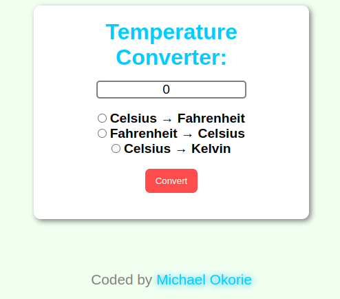

# Temperature Converter

A simple and responsive temperature converter built using vanilla JavaScript. This app allows users to convert between Celsius, Fahrenheit, and Kelvin with real-time input validation and accurate calculations.

---

## Table of Contents

- [Overview](#overview)
- [Features](#features)
- [Built With](#built-with)
- [Live Demo](#live-demo)
- [Getting Started](#getting-started)
- [What I Learned](#what-i-learned)
- [Author](#author)
- [Acknowledgments](#acknowledgments)

---

## Screenshot



--- 

## Overview

This beginner-friendly project was created to practice:
- Handling form inputs
- DOM manipulation
- Conditional logic
- Basic math operations in JavaScript

---

## Features

- ✅ Converts between Celsius, Fahrenheit, and Kelvin
- ✅ Input validation (empty input & non-numeric values)
- ✅ Clean and minimal user interface
- ✅ Result rounding to one decimal place
- ✅ Instant feedback when user input is invalid

---

## Built With

- HTML5
- CSS3
- JavaScript (ES6+)
- Mobile-first design principles

---

## Live Demo

> [View it live](https://michael-okorie.github.io/Temperature-Converter/)
> [Github repo](https://github.com/Michael-Okorie/Temperature-Converter.git)  

---

## Getting Started

To run this project locally:

```bash
git clone https://github.com/yourusername/temperature-converter.git
cd temperature-converter
open index.html
```

---

## What I Learned

Through this project, I reinforced my understanding of:

- How to access and validate form inputs using JavaScript
- The difference between `return` and `break`
- How to display feedback dynamically on the DOM
- Floating-point math and using `.toFixed()` for formatting

---

## Author

- Frontend Mentor – [@Michael-Okorie](https://www.frontendmentor.io/profile/Michael-Okorie)
- GitHub – [@Michael-Okorie](https://github.com/Michael-Okorie)
- Twitter – [@Dev_Michael_](https://x.com/Dev_Michael_)
